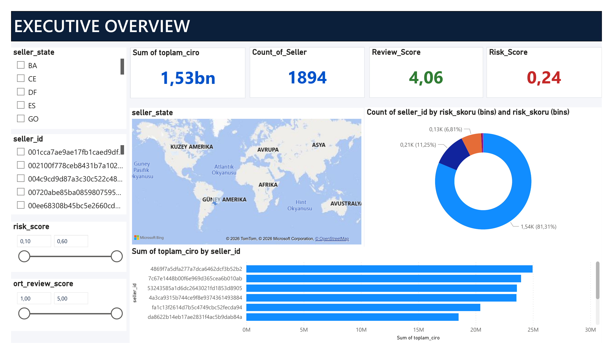
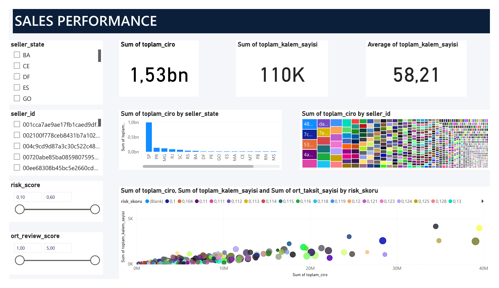
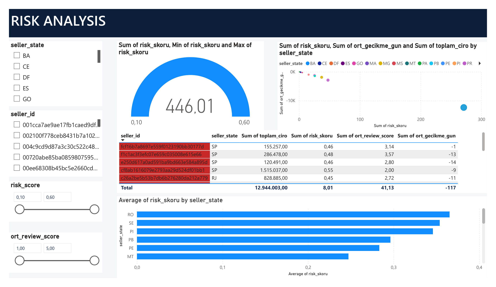
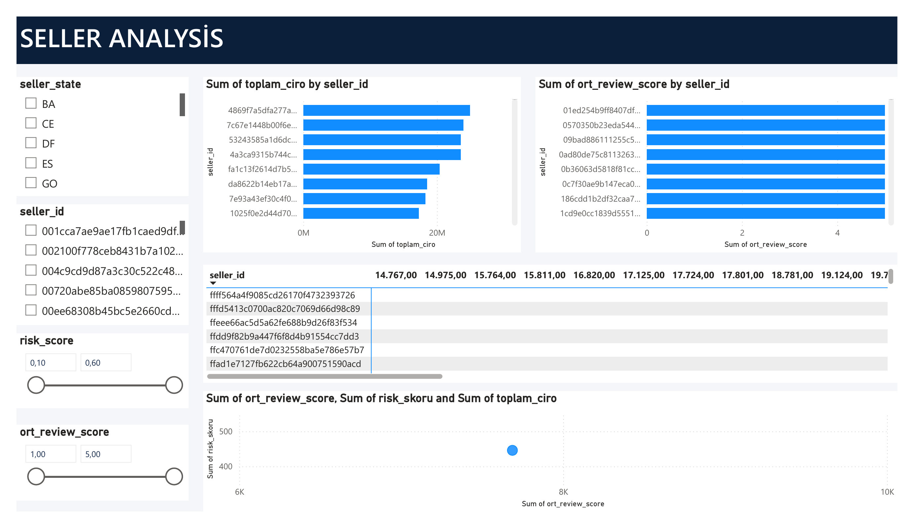
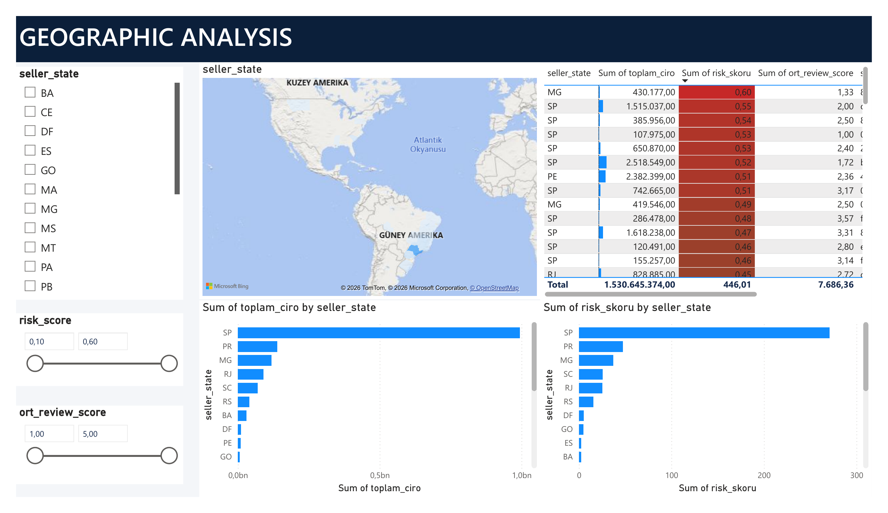
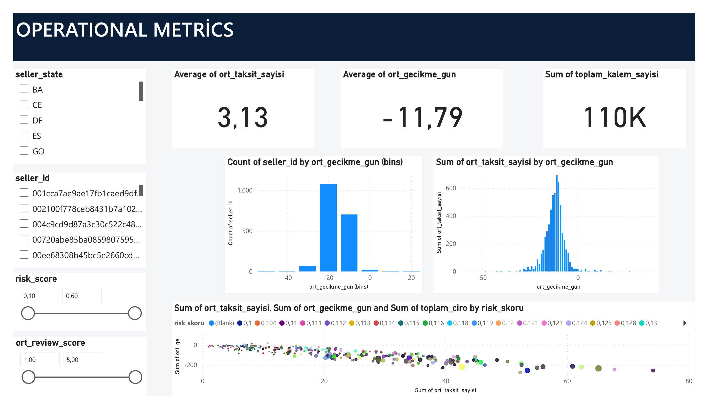
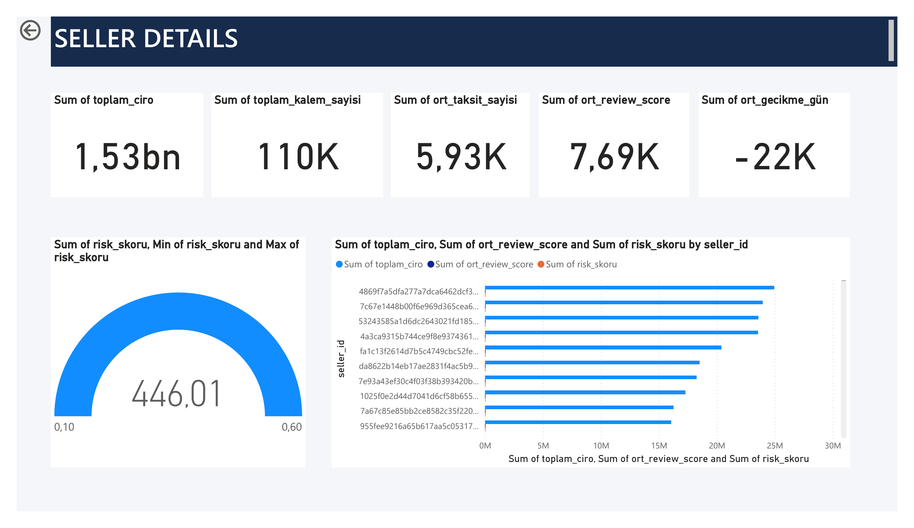

# 📊 Seller Financial Health & Risk Score

### An end-to-end analytics pipeline that turns raw e-commerce transaction data into an executive-grade risk intelligence dashboard.

[](https://www.python.org/)
[](https://www.microsoft.com/sql-server)
[](https://powerbi.microsoft.com/)
[](https://pandas.pydata.org/)
[](LICENSE)
[](https://github.com/sedefaksin/satici-finansal-risk-skoru/commits/main)
[](https://github.com/sedefaksin/satici-finansal-risk-skoru/stargazers)

---

## 🖼️ Dashboard Preview

**Executive Overview**


**Sales Performance**


**Risk Analysis**


**Seller Analysis**


**Geographic Analysis**


**Operational Metrics**


**Seller Detail (Drill-Through)**


---

## 📌 About The Project

This project simulates a real analytics engagement: a marketplace platform needs to understand **which sellers pose a growing financial and operational risk** before that risk turns into lost revenue, damaged customer trust, or platform liability.

Using the [Olist Brazilian E-Commerce Public Dataset](https://www.kaggle.com/datasets/olistbr/brazilian-ecommerce) — a real, relational, 9-table dataset — the project was built the way a production analytics workflow actually gets built: starting from raw, imperfect data in a relational database, resolving real schema issues, engineering a defensible scoring methodology, validating it statistically, and finally packaging it into a decision-ready Power BI dashboard.

The goal was not to produce "a dashboard." It was to demonstrate the **full analytics lifecycle**: data modeling → transformation → statistical validation → business storytelling.

---

## 💼 Business Problem

Marketplace platforms depend on thousands of independent sellers, but not all sellers carry the same risk profile. A seller with high revenue but a pattern of late deliveries, poor customer reviews, and heavy reliance on installment payments represents a **hidden liability** — one that traditional revenue-only reporting fails to surface.

This project answers a concrete business question:

> **"Which sellers are quietly accumulating financial and operational risk, and where should the platform focus its account management attention first?"**

The resulting dashboard gives operations and risk teams a single, ranked view of seller health — instead of scattered metrics across delivery, payments, and review systems.

---

## 🎯 Objectives

- Consolidate seller performance data scattered across 9 relational tables into a single analytical model
- Design a transparent, weighted **Risk Score** grounded in business logic, not a black box
- Statistically validate the scoring assumptions using correlation analysis
- Correct for a real data integrity issue (small-sample bias in seller ratings) before trusting the score
- Deliver the findings through a multi-page, executive-ready Power BI dashboard
- Document the full methodology so the analysis is reproducible and auditable

---

## 🗂️ Dataset Overview

Source: [Olist Brazilian E-Commerce Public Dataset](https://www.kaggle.com/datasets/olistbr/brazilian-ecommerce) (9 relational tables: `orders`, `order_items`, `order_payments`, `order_reviews`, `customers`, `sellers`, `products`, `geolocation`, `product_category_name_translation`)

The final analytical table (`Query1`) produced by the SQL pipeline exposes one row per seller:

| Column | Data Type | Business Meaning | Analytical Usage |
|---|---|---|---|
| `seller_id` | Text | Unique identifier of the seller | Grain of the analysis; join key for drill-through |
| `seller_state` | Text | Brazilian state where the seller operates | Geographic segmentation and regional risk comparison |
| `toplam_ciro` (Total Revenue) | Decimal | Sum of item price + freight value across all orders | Revenue-weighting component of the risk score |
| `toplam_kalem_sayisi` (Total Items Sold) | Integer | Number of order line items sold | Sample-size filter (excludes sellers with < 5 items to avoid unreliable averages) |
| `ort_review_score` (Avg. Review Score) | Decimal (1–5) | Average customer satisfaction rating | Inverse driver of risk — lower score increases risk |
| `ort_taksit_sayisi` (Avg. Installment Count) | Decimal | Average number of payment installments used by buyers | Strongest driver of financial risk (highest weight) |
| `ort_gecikme_gun` (Avg. Delivery Delay, days) | Decimal | Actual delivery date minus estimated delivery date | Operational risk signal; negative values indicate early delivery |
| `risk_skoru` (Risk Score) | Decimal (0–1) | Weighted, normalized composite risk indicator | Primary KPI of the entire dashboard |

---

## 🏗️ Project Architecture

```
                 ┌──────────────────────┐
                 │   SQL Server (OLAP)  │
                 │  9 relational tables │
                 │   (Olist dataset)    │
                 └──────────┬───────────┘
                            │  CTEs, window functions,
                            │  JOINs, min-max normalization
                            ▼
                 ┌──────────────────────┐
                 │   Risk Score Query   │
                 │  (weighted, 0–1)     │
                 └──────────┬───────────┘
                 ┌──────────┴───────────┐
                 ▼                      ▼
        ┌────────────────┐    ┌──────────────────┐
        │     Python      │    │     Power BI      │
        │ Statistical     │    │  7-page Executive │
        │ validation +    │    │  Dashboard         │
        │ visualization   │    │  (DAX-free,        │
        │ (pandas, seaborn│    │  drag & drop)       │
        └────────────────┘    └──────────────────┘
                 │                      │
                 └──────────┬───────────┘
                            ▼
                 ┌──────────────────────┐
                 │   Business Insights   │
                 │  Seller risk ranking, │
                 │  regional exposure,   │
                 │  operational alerts   │
                 └──────────────────────┘
```

---

## 🔄 Analytics Pipeline

1. **Data Ingestion** — 9 raw CSVs imported into Microsoft SQL Server (`OlistDB`), resolving real-world issues along the way: NULL constraint violations on optional date fields, and a composite primary key requirement on `order_items` (`order_id` + `order_item_id`) due to its one-to-many relationship with orders.

2. **Schema Discovery** — Table relationships mapped programmatically via `INFORMATION_SCHEMA.COLUMNS` rather than assumed, ensuring JOIN logic was grounded in the actual database structure.

3. **Metric Engineering (SQL)** — Seller-level metrics computed via `LEFT JOIN`s across `sellers`, `order_items`, `orders`, `order_payments`, and `order_reviews`. Two CTEs (`cte_reviews`, `cte_payments`) pre-aggregate review scores and installment counts **at the order level before joining**, preventing a join-fanout bug that would have silently inflated averages for multi-item orders.

4. **Normalization & Scoring (SQL)** — All four risk components (installments, review score, delivery delay, revenue) are min-max normalized to a 0–1 scale using window functions (`MIN() OVER()`, `MAX() OVER()`), then combined into a single weighted Risk Score:

   | Component | Weight | Direction |
   |---|---|---|
   | Avg. Installment Count | 40% | Higher = riskier |
   | Avg. Review Score | 30% | Lower = riskier |
   | Avg. Delivery Delay | 20% | Higher = riskier |
   | Total Revenue | 10% | Lower = riskier |

5. **Data Quality Correction** — Sellers with fewer than 5 sold items were excluded from the scored population, since averages computed from 1–2 reviews were statistically unreliable and were distorting the top-risk rankings.

6. **Statistical Validation (Python)** — A correlation analysis confirmed the weighting logic: installment count (r = 0.74) and review score (r = −0.70) strongly explain the risk score, while delivery delay (r = 0.05) and revenue (r = −0.01) showed negligible correlation. Weights were **kept as originally designed** for business reasons, and this finding is reported transparently rather than silently adjusted.

7. **Visualization (Python)** — Risk score distribution and installment/review relationship visualized with `matplotlib`/`seaborn` to sanity-check the model before dashboard development.

8. **Dashboard Development (Power BI)** — The validated dataset was connected live to SQL Server and built into a 7-page executive dashboard with a consistent corporate design system (see below).

---

## 📑 Dashboard Pages

The dashboard follows a corporate design system (Primary `#0052CC`, Success/Warning/Danger risk semantics, Segoe UI typography, 240px fixed filter panel) applied consistently across all pages.

### 1. Executive Overview
- **Purpose:** Give leadership a 5-second read on overall seller health and risk exposure.
- **KPIs:** Total Revenue, Active Seller Count, Avg. Review Score, Avg. Risk Score
- **Visualizations:** Filled map (revenue by state), risk distribution donut, Top 10 sellers by revenue
- **Business Questions Answered:** Is the seller base healthy overall? Which states drive the most revenue?

### 2. Sales Performance
- **Purpose:** Break down revenue and order volume across sellers and categories.
- **KPIs:** Total Revenue, Total Items Sold, Avg. Order Value
- **Visualizations:** Revenue trend and comparison charts, seller-level revenue breakdown
- **Business Questions Answered:** Which sellers generate the highest revenue? How concentrated is revenue among top sellers?

### 3. Risk Analysis
- **Purpose:** Deep-dive into the Risk Score to identify and rank at-risk sellers.
- **KPIs:** Avg. Risk Score, High-Risk Seller Count, Risk Score Distribution
- **Visualizations:** Risk score histogram, ranked risk table, risk-by-state comparison
- **Business Questions Answered:** Which sellers require immediate risk mitigation? Is risk concentrated in specific regions?

### 4. Seller Analysis
- **Purpose:** Compare sellers side by side across all core metrics.
- **KPIs:** Revenue, Item Count, Review Score, Installment Count per seller
- **Visualizations:** Multi-metric comparison table/matrix
- **Business Questions Answered:** Which sellers require operational improvement? How do top and bottom performers differ?

### 5. Geographic Analysis
- **Purpose:** Understand performance and risk through a regional lens.
- **KPIs:** Revenue by State, Avg. Risk Score by State
- **Visualizations:** Filled map, state-level ranked bar chart
- **Business Questions Answered:** Which states have the highest operational risk? Where should regional account management be reinforced?

### 6. Operational Metrics
- **Purpose:** Surface delivery and payment behavior patterns that feed the risk model.
- **KPIs:** Avg. Installment Count, Avg. Delivery Delay, Avg. Items per Seller
- **Visualizations:** Delay distribution histogram, installment distribution histogram, delay-vs-installment scatter (sized by revenue, colored by risk)
- **Business Questions Answered:** Is review score correlated with delivery delays? Do high-installment sellers also show operational strain?

### 7. Seller Detail (Drill-Through)
- **Purpose:** A 360° single-seller view accessible from any page via drill-through.
- **KPIs:** All core metrics for the selected seller, plus a Risk Score gauge
- **Visualizations:** Seller-vs-state-average comparison chart
- **Business Questions Answered:** How does this specific seller compare to its regional peers?

---

## 📈 KPI Reference

| Metric | Formula | Business Meaning |
|---|---|---|
| Total Revenue | `SUM(price + freight_value)` | Overall financial scale of a seller or region |
| Avg. Review Score | `AVG(review_score)` per order, aggregated per seller | Customer satisfaction proxy |
| Avg. Installment Count | `AVG(payment_installments)` per order, aggregated per seller | Buyer payment risk proxy |
| Avg. Delivery Delay | `AVG(delivered_date − estimated_date)` in days | Operational reliability |
| Risk Score | `0.40×installments_norm + 0.30×(1−review_norm) + 0.20×delay_norm + 0.10×(1−revenue_norm)` | Composite, normalized 0–1 risk indicator |

---

## 💡 Key Insights

- Which sellers generate the highest revenue, and does high revenue correlate with lower risk?
- Which states carry the highest concentration of operationally risky sellers?
- Is review score correlated with delivery delays? *(Tested — see Analytics Pipeline, step 6)*
- Which sellers combine high installment usage with low review scores, and therefore need account management attention first?
- How is risk distributed across the seller base — is it a widespread issue or concentrated in a small tail?

---

## 🛠️ Tech Stack

| Layer | Tool |
|---|---|
| 🗄️ Database | Microsoft SQL Server |
| 🐍 Language | Python 3.13 (pandas, sqlalchemy, pyodbc, matplotlib, seaborn) |
| 📊 BI / Visualization | Power BI Desktop |
| 🔧 Version Control | Git & GitHub |
| 📓 Query Language | T-SQL (CTEs, window functions, JOINs) |

---

## 📁 Repository Structure

```
📦 satici-finansal-risk-skoru
 ├── sql/
 │   └── risk_skoru_sorgusu.sql
 ├── python/
 │   └── analiz_ve_gorsellestirme.py
 ├── powerbi/
 │   └── satici_dashboard.pbix
 ├── images/
 │   └── (dashboard screenshots)
 ├── kilavuz/
 │   └── metodoloji.md
 ├── README.md
 └── requirements.txt
```

---

## ⚙️ Installation

```bash
# 1. Clone the repository
git clone https://github.com/sedefaksin/satici-finansal-risk-skoru.git
cd satici-finansal-risk-skoru

# 2. Install Python dependencies
pip install -r requirements.txt

# 3. Restore the Olist dataset into SQL Server
#    Download from: https://www.kaggle.com/datasets/olistbr/brazilian-ecommerce
#    Import the 9 CSVs into a database named OlistDB

# 4. Run the SQL pipeline
#    Execute sql/risk_skoru_sorgusu.sql in SQL Server Management Studio

# 5. Run the Python validation & visualization script
python python/analiz_ve_gorsellestirme.py

# 6. Open the dashboard
#    Open powerbi/satici_dashboard.pbix in Power BI Desktop
#    Update the SQL Server connection to point to your local instance
```

---

## 🚀 How To Use

1. Set up `OlistDB` in SQL Server and run the risk score query.
2. Open the Power BI file and refresh the data connection.
3. Start on the **Executive Overview** page for a high-level read.
4. Use the left filter panel to narrow by state, seller, or risk range.
5. Right-click any seller row and select **Drill Through → Seller Detail** for a full 360° view.
6. Cross-navigate between **Risk Analysis** and **Geographic Analysis** to investigate regional risk concentration.

---

## 💰 Business Value

- Replaces fragmented, single-metric seller monitoring with one unified, ranked risk view
- Enables proactive account management — surfacing risk before it materializes into lost revenue or churn
- Gives regional teams a geographic lens to prioritize where intervention has the highest impact
- Provides a transparent, auditable scoring methodology instead of an opaque black-box metric — every weight and its statistical validation is documented

---

## 🔮 Future Improvements

- [ ] Migrate the pipeline to Azure SQL or Microsoft Fabric for cloud-native scalability
- [ ] Add incremental refresh for near real-time dashboard updates
- [ ] Introduce a Bayesian-adjusted score to better handle low-sample sellers instead of a hard filter
- [ ] Build a predictive model (churn/default risk forecasting) on top of the current descriptive score
- [ ] Implement Row-Level Security (RLS) for regional manager-specific views
- [ ] Add a real-time alerting layer for sellers crossing a critical risk threshold

---

## 📸 Screenshots

| Page | File |
|---|---|
| Executive Overview | `images/executive_overview.png` |
| Sales Performance | `images/sales_performance.png` |
| Risk Analysis | `images/risk_analysis.png` |
| Seller Analysis | `images/seller_analysis.png` |
| Geographic Analysis | `images/geographic_analysis.png` |
| Operational Metrics | `images/operational_metrics.png` |
| Seller Detail (Drill-Through) | `images/seller_detail.png` |

---

## 👤 Author

**Sedef Akşin**
Management Information Systems Student | Aspiring Data Analyst

- GitHub: [github.com/sedefaksin](https://github.com/sedefaksin)
- LinkedIn: [linkedin.com/in/sedefaksin](https://linkedin.com/in/sedefaksin)
- Portfolio: *add link*

---

## 📄 License

This project is licensed under the MIT License — see the [LICENSE](LICENSE) file for details.
